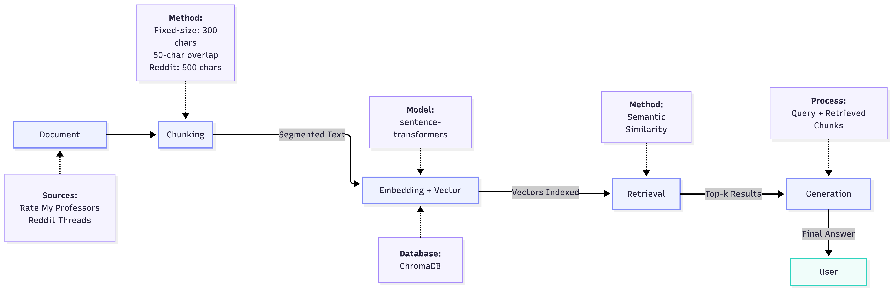

# Project 1 Planning: The Unofficial Guide

> Write this document before you write any pipeline code.
> Your spec and architecture diagram are what you'll use to direct AI tools (Claude, Copilot, etc.) to generate your implementation — the more specific they are, the more useful the generated code will be.
> Update the Retrieval Approach and Chunking Strategy sections if you change your approach during implementation.
> Update this file before starting any stretch features.

---

## Domain

Student reviews, ratings, and experiences with professors of Computer Science Department at the University of Texas at Arlington, with a focus on helping students evaluate instructors before registering for their courses.

This knowledge is valuable because it provides insights into teaching style, workload, and all other qualities of the instructor that a student needs, to make informed decision while choosing to take their classes. Official university pages, or instructors profile only provides course descriptions but rarely include any detailed feedback from students who have taken the course. As a result, many students go over various scattered unofficial sources, such as Rate My Professors, and Reddit discussions to make informed decision.

<!-- What domain did you choose? Why is this knowledge valuable and hard to find through official channels? -->

---

## Documents

<!-- List your specific sources: URLs, subreddit names, forum threads, or file descriptions.
     Aim for at least 10 sources that together cover different subtopics or perspectives within your domain. -->

| #   | Source                                                                 | Description                                                                                                                                                                                                                                               | URL or location                                                                                          |
| --- | ---------------------------------------------------------------------- | --------------------------------------------------------------------------------------------------------------------------------------------------------------------------------------------------------------------------------------------------------- | -------------------------------------------------------------------------------------------------------- |
| 1   | Rate My Professor - David Kung                                         | Student ratings and reviews discussing teaching style, workload, grading practices, attendance policy, and experiences in courses taught by this professor, including CSE 4361, CSE 3311, and CSE 4351.                                                   | https://www.ratemyprofessors.com/professor/1226648                                                       |
| 2   | Rate My Professor - Ishfaq Ahmad                                       | Student ratings and reviews discussing teaching style, workload, grading practices, attendance policy, and experiences in courses taught by this professor, including CSE 6339, CSE 4351, CSE 1311, and CSE 5351.                                         | https://www.ratemyprofessors.com/professor/1444520                                                       |
| 3   | Rate My Professor - Jimmie Davis                                       | Student ratings and reviews discussing teaching style, workload, grading practices, attendance policy, and experiences in courses taught by this professor, including CSE 3310, and CSE 1106.                                                             | https://www.ratemyprofessors.com/professor/2218914                                                       |
| 4   | Rate My Professor - Linda Barasch                                      | Student ratings and reviews discussing teaching style, workload, grading practices, attendance policy, and experiences in courses taught by this professor, including CSE 3315, and CSE 1310.                                                             | https://www.ratemyprofessors.com/professor/619690                                                        |
| 5   | Rate My Professor - Manfred Huber                                      | Student ratings and reviews discussing teaching style, workload, grading practices, attendance policy, and experiences in courses taught by this professor, including CSE 6349, CSE 2312, CSE 2315, CSE 3315, CSE 4360, CSE 4379, CSE 5361, and CSE 5364. | https://www.ratemyprofessors.com/professor/529522                                                        |
| 6   | Rate My Professor - Donna French                                       | Student ratings and reviews discussing teaching style, workload, grading practices, attendance policy, and experiences in courses taught by this professor, including CSE 1320, CSE 1310, CSE 1325, CSE 2320 and CSE 3318.                                | https://www.ratemyprofessors.com/professor/2346663                                                       |
| 7   | Rate My Professor - Bob Weems                                          | Student ratings and reviews discussing teaching style, workload, grading practices, attendance policy, and experiences in courses taught by this professor, including CSE 3318, CSE 2302, CSE 2320, CSE 5311, and CSE 3302.                               | https://www.ratemyprofessors.com/professor/432105                                                        |
| 8   | Rate My Professor - Bahram Khalili                                     | Student ratings and reviews discussing teaching style, workload, grading practices, attendance policy, and experiences in courses taught by this professor, including CSE 3310, CSE 5306, and CSE 5326.                                                   | https://www.ratemyprofessors.com/professor/1055888                                                       |
| 9   | Rate My Professor - John Robb                                          | Student ratings and reviews discussing teaching style, workload, grading practices, attendance policy, and experiences in courses taught by this professor, including CSE 5321, CSE 3302, CSE 4321, CSE 5234, CSE 5423, and CSE 6329.                     | https://www.ratemyprofessors.com/professor/1998025                                                       |
| 10  | Rate My Professor - Changekai Li                                       | Student ratings and reviews discussing teaching style, workload, grading practices, attendance policy, and experiences in courses taught by this professor, including CSE 5334, CSE 4334, CSE 3330 and CSE 5344.                                          | https://www.ratemyprofessors.com/professor/1151666                                                       |
| 11  | Rate My Professor - Marika Apostolova                                  | Student ratings and reviews discussing teaching style, workload, grading practices, attendance policy, and experiences in courses taught by this professor, including CSE 1320, and CSE 1325.                                                             | https://www.ratemyprofessors.com/professor/2925654                                                       |
| 12  | Rate My Professor - Bhanu Jain                                         | Student ratings and reviews discussing teaching style, workload, grading practices, attendance policy, and experiences in courses taught by this professor, including CSE 1301, CSE 1310, CSE 1320, CSE 3318, CSE 3330 and CSE 5311.                      | https://www.ratemyprofessors.com/professor/2473801                                                       |
| 13  | Rate My Professor - Vamsikrishna Gopikrishna                           | Student ratings and reviews discussing teaching style, workload, grading practices, attendance policy, and experiences in courses taught by this professor, including CSE 2315, CSE 4308, CSE 5301 and CSE 5360.                                          | https://www.ratemyprofessors.com/professor/2272923                                                       |
| 14  | Rate My Professor - Nadra Guizani                                      | Student ratings and reviews discussing teaching style, workload, grading practices, attendance policy, and experiences in courses taught by this professor, including CSE 1310, CSE 3310, CSE 3330 and CSE 4309.                                          | https://www.ratemyprofessors.com/professor/2635253                                                       |
| 15  | Rate My Professor - Abhishek Santra                                    | Student ratings and reviews discussing teaching style, workload, grading practices, attendance policy, and experiences in courses taught by this professor, including CSE 2315, and CSE 5330.                                                             | https://www.ratemyprofessors.com/professor/2774504                                                       |
| 16  | Reddit - Help in choosing classes based on professors need preferences | Student discussion thread containing recommendations, opinions, and advice regarding CSE 3318, CSE 1325, and CSE 2312.                                                                                                                                    | https://www.reddit.com/r/utarlington/comments/1ps7xnd/help_in_choosing_classes_based_on_professors_need/ |
| 17  | Reddit - Review of CSE 3311 CSE 3302 CSE 4322                          | Student discussion thread containing review of CSE 3311, CSE 3302, and CSE 4322.                                                                                                                                                                          | https://www.reddit.com/r/utarlington/comments/1kquhqp/review_of_cse_3311_cse_3302_cse_4322/              |
| 18  | Reddit - CSE 4308                                                      | Student discussion thread containing recommendations, opinions, and advice regarding CSE 4308.                                                                                                                                                            | https://www.reddit.com/r/utarlington/comments/1s8te40/cse_4308/                                          |
| 19  | Reddit - CSE 3330                                                      | Student discussion thread containing recommendations, opinions, and advice regarding CSE 3330                                                                                                                                                             | https://www.reddit.com/r/utarlington/comments/1omzpnr/cse_3330/                                          |
| 20  | Reddit - Cse 3315 theoretical                                          | Student discussion thread containing recommendations, opinions, and advice regarding CSE 3315 (Theoritical Concepts in Computer Science and Engineering).                                                                                                 | https://www.reddit.com/r/utarlington/comments/1olduor/cse_3315_theoretical/                              |

---

## Chunking Strategy

<!-- How will you split documents into chunks?
     State your chunk size (in tokens or characters), overlap size, and explain why those
     numbers fit the structure of your documents.
     A review-heavy corpus warrants different chunking than a long FAQ. -->

**Chunk size:** Variable-sized chunks based on natural document boundaries. Each Rate My Professors review is treated as a single chunk, and each Reddit reply/comment is treated as a single chunk. If an individual review or Reddit reply exceeds 1,000 characters, fixed-size chunking is used as a fallback with 500-character chunks.

**Overlap:** No overlap is used when chunking by natural boundaries because complete reviews and replies already preserve context. For the fixed-size fallback strategy, a 100-character overlap is applied to maintain continuity across chunk boundaries.

**Reasoning:** Initial retrieval experiments using fixed-size chunking revealed that important ideas were sometimes split across chunk boundaries, particularly within Reddit discussions. Since Rate My Professors reviews and Reddit replies are naturally occurring semantic units that often express a complete opinion or experience, preserving these boundaries improves retrieval quality and produces more meaningful chunks. Fixed-size chunking is retained only as a fallback for unusually long reviews or comments that exceed 1,000 characters, ensuring that large pieces of text remain manageable while minimizing the loss of context.

---

## Retrieval Approach

<!-- Which embedding model are you using (e.g., all-MiniLM-L6-v2 via sentence-transformers)?
     How many chunks will you retrieve per query (top-k)?
     If you were deploying this for real users and cost wasn't a constraint, what tradeoffs
     would you weigh in choosing a different embedding model — context length, multilingual
     support, accuracy on domain-specific text, latency? -->

**Embedding model:** all-MiniLM-L6-v2 via sentence-transformers

**Top-k:** 5 most relevant chunks

**Production tradeoff reflection:** If cost and computational constraints were not a concern, larger embedding models with stronger semantic understanding and longer context capabilities could be considered to improve retrieval accuracy.

---

## Evaluation Plan

<!-- List your 5 test questions with their expected correct answers.
     Questions should be specific enough that you can judge whether the system's response
     is right or wrong. "What are good dining halls?" is too vague.
     "What do students say about wait times at [dining hall name] during lunch?" is testable. -->

| #   | Question                                                                      | Expected answer                                                                                                          |
| --- | ----------------------------------------------------------------------------- | ------------------------------------------------------------------------------------------------------------------------ |
| 1   | How does Professor Manfred Huber typically conduct his lectures?              | He uses little to no slides and primarily teaches by working through mathematical derivations on the whiteboard.         |
| 2   | Which professor do students commonly recommend for CSE 3318?                  | Students commonly recommend Professor Donna French or Professor Stefan for CSE 3318.                                     |
| 3   | When do students suggest taking CSE 3318 with Donna French?                   | Students recommend taking CSE 3318 during the summer if the course is available                                          |
| 4   | How is grading curved in David Kung's CSE 3311 class?                         | The grading scale is automatically curved, with approximately a 60 corresponding to a C and an 85 corresponding to an A. |
| 5   | What percentage of students say they would take Abishek Santra's class again? | Approximately 88.9% of students said they would take his class again.                                                    |

---

## Anticipated Challenges

<!-- What could go wrong? Name at least two specific risks with reasoning.
     Consider: noisy or inconsistent documents, missing source attribution, off-topic
     retrieval, chunks that split key information across boundaries. -->

1. Conflicting or inconsistent reviews: Students experience can vary significantly. Some might have positive opinion of a professor while other may report negative experience.

2. Limited or incomplete source material. Some professors or courses may have only a small number of reddit discussion forum posts or reviews available. As a result, the retrieved information may not capture the full range of student experiences and could lead to biased responses.

---

## Architecture

<!-- Draw a diagram of your pipeline showing the five stages:
     Document Ingestion → Chunking → Embedding + Vector Store → Retrieval → Generation
     Label each stage with the tool or library you're using.
     You can use ASCII art, a Mermaid diagram, or embed a sketch as an image.
     You'll use this diagram as context when prompting AI tools to implement each stage. -->

## 

## AI Tool Plan

<!-- For each part of the pipeline below, describe:
     - Which AI tool you plan to use (Claude, Copilot, ChatGPT, etc.)
     - What you'll give it as input (which sections of this planning.md, which requirements)
     - What you expect it to produce
     - How you'll verify the output matches your spec

     "I'll use AI to help me code" is not a plan.
     "I'll give Claude my Chunking Strategy section and ask it to implement chunk_text()
     with my specified chunk size and overlap" is a plan. -->

**Milestone 3 — Ingestion and chunking:**
I will use ChatGPT to help refine my chunking strategy and explain tradeoffs between different chunking approaches based on my document types. I will use Claude for imlementation within my repository by asking it to generate functions that load .txt documents, clean the text, and implement fixed-size chunking according to my specifications. I will verify the output by manually inspecting a sample of generated chunks to ensure they preserve meaningful context and match the intended chunk sizes and overlaps.

**Milestone 4 — Embedding and retrieval:**
I will use Gemini, ChatGPT and Claude to understand the concepts behind semantic search, ChromaDB, and retrieval settings such as top-k selection. I will provide Claude with the requirements for using the all-MiniLM-L6-v2 embedding model and ChromaDB, and ask it to implement the embedding generation pipeline, populate the vector database, and perform top-k retrieval. I will verify correctness by testing known queries and confirming that the retrieved chunks are relevant and originate from the expected source documents.

**Milestone 5 — Generation and interface:**
I will use ChatGPT to brainstorm interface ideas, improve prompts, and evaluate the quality of generated responses. I will use Claude to implement the generation pipeline that combines the user's query with retrieved chunks and passes the context to the language model to generate answers. I will verify the implementation by comparing responses against my evaluation questions, checking that answers are grounded in the retrieved sources, and ensuring the system does not fabricate information that is unsupported by the documents.
